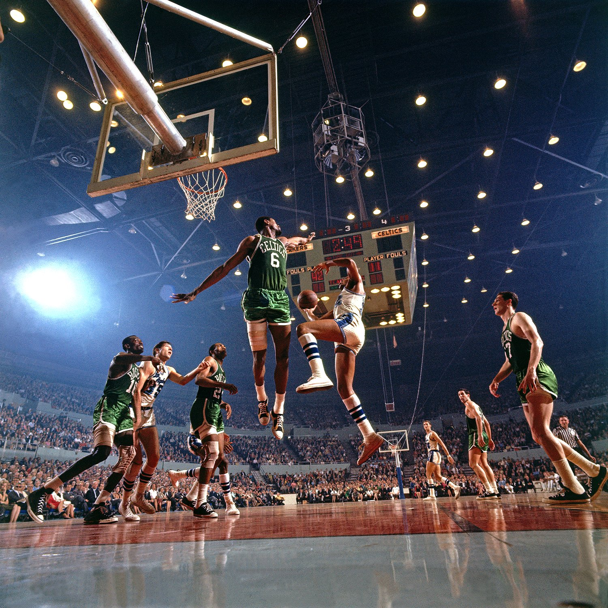
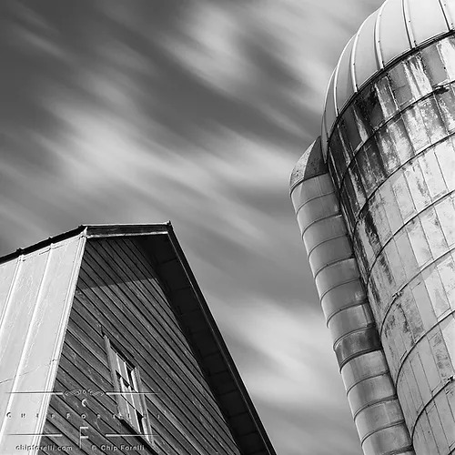

# Examining the Masters

## Stopped Motion

This image I think is a phenomenal example of stopped motion photography we see two basketball players frozen in air that are being immaculately lit. We can also see the image in the background that despite the absolute brightness of it seems to be kept into relative check which gives a lot of contrast in the photography. The angles and framing given by the outside players is absolutely phenomenal. There's so much to learn from this photo. I will say there is a lot of graininess in the photo. I'm curious if the graininess was a byproduct of the equipment or if it was an intentional choice based on his stylization of the photo.

## Blurred Motion

This image is an impeccable use of blur. I love the inversion of the way that I was thinking of it where he took the shot of the moving clouds. Part of it was almost certainly the fact the clouds were moving quickly. I think Being able to give such a well exposed photo with such a long exposure is awesome. It makes me wonder how he accomplished it. Especially because I had the problem that when I was taking my pictures getting an image with a blur that was even a second would be entirely over exposed. That probably could have been fixed with different lenses and photos taken closer to night.
