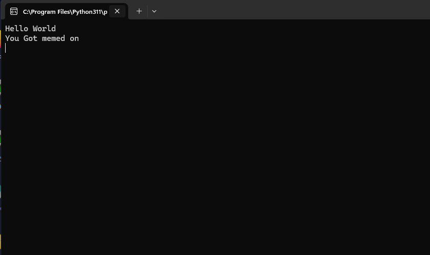

# Rubber Duck Assignment

## Script

```bash
DELAY 1000

GUI r

DELAY 500

STRING notepad.exe

ENTER

DELAY 1000

STRING print("Hello World")

ENTER

STRING print("You Got memed on")

ENTER

STRING input()

DELAY 500

CONTROL SHIFT S

DELAY 500

STRING C:\Users\Public\file.py

ENTER

DELAY 1000

GUI R

DELAY 500

python C:\Users\Public\file.py
```

In this assignment I wanted to gain remote code execution and I opted to do that via creating a script on the local machine. Afterall I feel as though nothing is more powerful than remote code execution. In this instance all the remote code does is it creates a python script that say "Hello world \\n You Got memed on" and then sets an input field so that I could get a screenshot. It also makes that code persistent and if i wanted I could even add it into startup execution.


